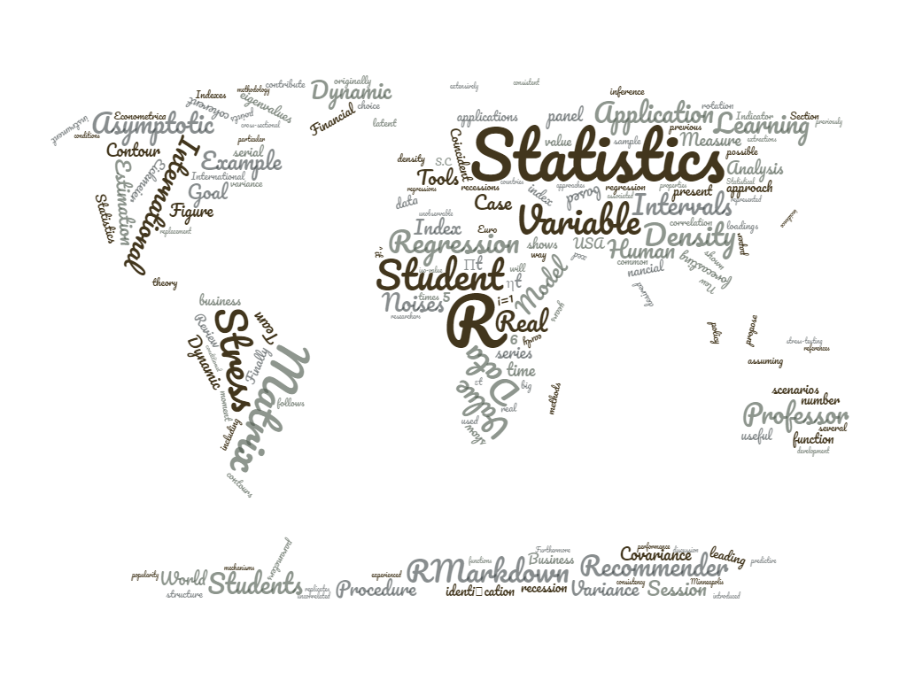

The workshop belongs to an innovation project by the [Department of Statistics](http://portal.uc3m.es/portal/page/portal/dpto_estadistica) of [Carlos III University of Madrid](http://www.uc3m.es/Home). This first edition is for students enrolled in the second and third year of the Degree in Statistics and Business Administration.

The materials for the case studies that are going to be discussed will be published in this website. Contact Javier De Vicente (javvicen@est-econ.uc3m.es) and Antonio Elías (aelias@est-econ.uc3m.es). 

<!-- -->

